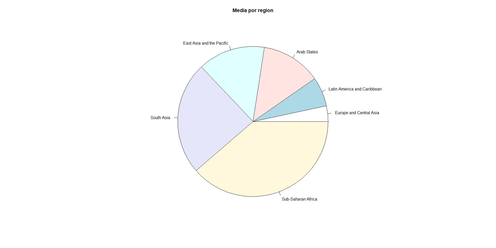
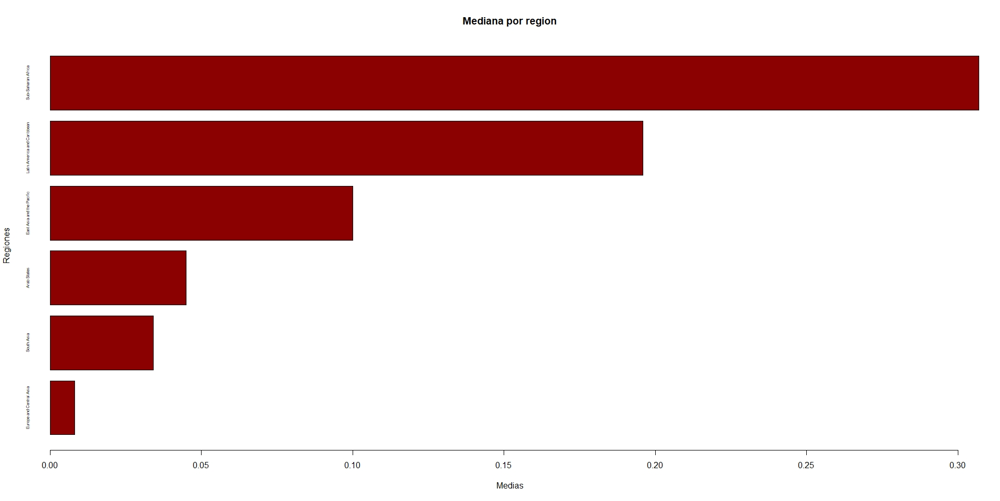

# TP00-123105

## Consignas:

A partir del dataset MPI_subnational.csv (Multidimensional Poverty Measures), se
solicita trabajar sobre las siguientes consignas:

### Exploración de datos.

Explore y explique en que consiste el dataset utilizando herramientas de exploración de datos.
	a. Releve las características de los atributos.
	b. Represente gráficamente la cantidad de ciudades agrupados por Región.

Para realizar esta tarea, lo primero que se hizo fue instalar el paquete tidyverse
que contiene entre otras cosas, la funcion read_csv que vamos a necesitar para
improtar los datos.

```r
> install.packages("tidyverse")
```

El package fue instalado desde el mirror de CRAN primero en la lista.
Luego de eso, ya podemos importar la libreria readr:

```r
> library(readr)
```

y finalmente, leer el archivo csv dentro de un dataset de R:

```r
> subnational<-read_csv("D:\\git\\123105-bdm\\TP00\\MPI_subnational.csv")
Parsed with column specification:
cols(
  `ISO country code` = col_character(),
  Country = col_character(),
  `Sub-national region` = col_character(),
  `World region` = col_character(),
  `MPI National` = col_double(),
  `MPI Regional` = col_double(),
  `Headcount Ratio Regional` = col_double(),
  `Intensity of deprivation Regional` = col_double()
)
```

Para relevar las características de los atributos, hacemos un resumen del dataset leido:

```r
> summary(subnational)
 ISO country code     Country          Sub-national region World region        MPI National     MPI Regional    Headcount Ratio Regional Intensity of deprivation Regional
 Length:984         Length:984         Length:984          Length:984         Min.   :0.0060   Min.   :0.0000   Min.   : 0.00            Min.   :33.30
 Class :character   Class :character   Class :character    Class :character   1st Qu.:0.0660   1st Qu.:0.0530   1st Qu.:12.47            1st Qu.:41.40
 Mode  :character   Mode  :character   Mode  :character    Mode  :character   Median :0.1740   Median :0.1550   Median :33.95            Median :45.60
                                                                              Mean   :0.2041   Mean   :0.2113   Mean   :40.18            Mean   :47.18
                                                                              3rd Qu.:0.3030   3rd Qu.:0.3415   3rd Qu.:66.72            3rd Qu.:51.90
                                                                              Max.   :0.6050   Max.   :0.7440   Max.   :99.00            Max.   :75.90
                                                                                                                                         NA's   :1
```

Para realizar la agrupacion, se instalo el paquete data.table:

```r
> install.packages("data.table")
```

El package fue instalado desde el mirror de CRAN primero en la lista.
Luego de eso, ya podemos importar la libreria data.table:

```r
> library(data.table)
```

Ahora convertimos el data.frame en un data.table y lo agrupamos por `World region`,
quedandonos con la cantidad de `Country` unicas para cada region:

```r
> dt <- data.table(subnational)
> dtu <- dt[, .(count = uniqueN(`Country`)), by=.(`World region`)]
                  World region count
1:                  South Asia     5
2:          Sub-Saharan Africa    38
3: Latin America and Caribbean    16
4:   East Asia and the Pacific     9
5:                 Arab States     8
6:     Europe and Central Asia     2
```

Acto seguido lo ordenamos de menor a mayor para mejorar la lectura:

```r
> dtu <- dtu[order(,-count,decreasing=TRUE),]
> dtu
                   World region count
1:     Europe and Central Asia     2
2:                  South Asia     5
3:                 Arab States     8
4:   East Asia and the Pacific     9
5: Latin America and Caribbean    16
6:          Sub-Saharan Africa    38
```

Finalmente lo graficamos:

```r
barplot(dtu$`count`, main = "Ciudades por region", xlab = "Ciudades", ylab = "Region", names.arg = dtu$`World region`, col = "darkred", horiz = TRUE, cex.names=.5)
```


---

### Medidas de posición.

Calcule las medidas de posición para los atributos numéricos y agrupe los cálculos de acuerdo a la Región.
	a. Ordene los resultados del MPI resultante y concluya al respecto.
	b. Grafique las variables y observe su comportamiento (graph: barplot, pie & hist).

Mediante la funcion summary es posible obtener de forma rapida las medidas de posicion de los
atributos numericos.

```r
> summary(dt)
MPI National     MPI Regional    Headcount Ratio Regional Intensity of deprivation Regional
Min.   :0.0060   Min.   :0.0000   Min.   : 0.00            Min.   :33.30
1st Qu.:0.0660   1st Qu.:0.0530   1st Qu.:12.47            1st Qu.:41.40
Median :0.1740   Median :0.1550   Median :33.95            Median :45.60
Mean   :0.2041   Mean   :0.2113   Mean   :40.18            Mean   :47.18
3rd Qu.:0.3030   3rd Qu.:0.3415   3rd Qu.:66.72            3rd Qu.:51.90
Max.   :0.6050   Max.   :0.7440   Max.   :99.00            Max.   :75.90                                                                                                                                          NA's   :1
```

No obstante, tambien posible calcularlos de forma individual:

```r
> mean(dt$`MPI National`)
[1] 0.2041067
> mean(dt$`MPI Regional`)
[1] 0.2113303
> mean(dt$`Headcount Ratio Regional`)
[1] 40.18445
> mean(dt$`Intensity of deprivation Regional`, na.rm=TRUE)
[1] 47.18098

> median(dt$`MPI National`)
[1] 0.174
> median(dt$`MPI Regional`)
[1] 0.155
> median(dt$`Headcount Ratio Regional`)
[1] 33.95
> median(dt$`Intensity of deprivation Regional`, na.rm=TRUE)
[1] 45.6

> install.packages("modeest")
> library("modeest")

> mfv(dt$`MPI National`)
[1] 0.066 0.303
> mfv(dt$`MPI Regional`)
[1] 0.006
> mfv(dt$`Headcount Ratio Regional`)
[1] 6.5
> mfv(dt$`Intensity of deprivation Regional`, na_rm=TRUE)
[1] 41.9 42.7                                                                                                                               NA's   :1
```

Notese que se utiliza la exclusion de Missing Values en el ultimo atributo para el
calculo de las medidas ya que el dataset presenta esta característica.
Ahora vamos a grupar el MPI por region en las tres medidas:

```r
> mpi.region.mean <- aggregate(`MPI National` ~ `World region`, data=dt, FUN=mean)
> mpi.region.mean <- mpi.region.mean[order(mpi.region.mean$`MPI National`), ]
                 World region MPI National
3     Europe and Central Asia   0.02890909
4 Latin America and Caribbean   0.05427064
1                 Arab States   0.11078261
2   East Asia and the Pacific   0.12432812
5                  South Asia   0.20904938
6          Sub-Saharan Africa   0.33203016

> mpi.region.median <- aggregate(`MPI National` ~ `World region`, data=dt, FUN=median)
> mpi.region.median <- mpi.region.median[order(mpi.region.median$`MPI National`), ]
                 World region MPI National
3     Europe and Central Asia        0.008
4 Latin America and Caribbean        0.034
1                 Arab States        0.045
2   East Asia and the Pacific        0.100
5                  South Asia        0.196
6          Sub-Saharan Africa        0.307

> mpi.region.mfv <- aggregate(`MPI National` ~ `World region`, data=dt, FUN=mfv)
> mpi.region.mfv <- mpi.region.mfv[order(mpi.region.mfv$`MPI National`), ]
                 World region MPI National
3     Europe and Central Asia        0.008
1                 Arab States        0.014
2   East Asia and the Pacific        0.066
4 Latin America and Caribbean        0.072
5                  South Asia        0.295
6          Sub-Saharan Africa        0.303
```

```r
> pie(mpi.region.mean$`MPI National`, labels = mpi.region.mean$`World region`, main = "Media por region")
> barplot(mpi.region.mean$`MPI National`, main = "Media por region", xlab = "Medias", ylab = "Regiones", names.arg = dtu$`World region`, col = "darkred", horiz = TRUE, cex.names=.5)

> pie(mpi.region.median$`MPI National`, labels = mpi.region.median$`World region`, main = "Media por region")
> barplot(mpi.region.median$`MPI National`, main = "Media por region", xlab = "Medias", ylab = "Regiones", names.arg = dtu$`World region`, col = "darkred", horiz = TRUE, cex.names=.5)

> pie(mpi.region.mfv$`MPI National`, labels = mpi.region.mfv$`World region`, main = "Media por region")
> barplot(mpi.region.mfv$`MPI National`, main = "Media por region", xlab = "Medias", ylab = "Regiones", names.arg = dtu$`World region`, col = "darkred", horiz = TRUE, cex.names=.5)

> hist(dt[dt[,`World region`]=="Europe and Central Asia",]$`MPI National`, main="Histograma de Europe and Central Asia", xlab = "MPI National", ylab = "Frecuencia")
> hist(dt[dt[,`World region`]=="Latin America and Caribbean",]$`MPI National`, main="Histograma de Latin America and Caribbean", xlab = "MPI National", ylab = "Frecuencia")
> hist(dt[dt[,`World region`]=="Arab States",]$`MPI National`, main="Histograma de Arab States", xlab = "MPI National", ylab = "Frecuencia")
> hist(dt[dt[,`World region`]=="South Asia",]$`MPI National`, main="Histograma de South Asia", xlab = "MPI National", ylab = "Frecuencia")
> hist(dt[dt[,`World region`]=="Sub-Saharan Africa",]$`MPI National`, main="Histograma de Sub-Saharan Africa", xlab = "MPI National", ylab = "Frecuencia")
> hist(dt[dt[,`World region`]=="East Asia and the Pacific",]$`MPI National`, main="Histograma de East Asia and the Pacific", xlab = "MPI National", ylab = "Frecuencia")
```







De los datos en crudo se pueden sacar varias conclusiones, algunas de ellas son:


Sobre "Europe and Central Asia":
	La pobreza es la mas baja de las regiones, con una mediana y moda iguales y
	muy por debajo de la media, se puede apreciar la existencia de un sector minoritario
	de la poblacion en extrema pobreza con una clase media/alta predominante.


Sobre "Latin America and Caribbean":
	Exactamente lo opuesto a la region previa, con una mediana y moda por debajo de la media,
	se puede apreciar la existencia de un sector minoritario de la poblacion
	con extrema riqueza con una clase baja predominante.


Sobre "Arab States":
	Con una mediana muy distante de la moda y la media, se puede apreciar que es una
	region dividad en dos, la mitad de la poblacion es muy pobre y otra mitad muy rica
	o de clase media, a diferencia de "Latin America and Caribbean" la riqueza se
	encuentra mejor distribuida pero solo en la mitad de la poblacion.


Sobre "East Asia and the Pacific":
	Con una mediana y media similares y una moda muy inferior, es una sociedad que
	presenta una mayor igualdad, sin la presencia de sectores concentrados ni en
	riqueza ni en pobreza, amplia presencia de clase media con predominancia de clase
	media/alta relativas a la region, aunque estas sean aproximadamente 6 veces mas
	pobres que la clase media de "Europe and Central Asia".


Sobre "South Asia":
	Con una mediana y media similares y una moda muy superior, es una sociedad que
	reparte la pobreza de forma igualitaria, con la presencia de sectores concentrados
	de pobreza extrema, una amplia presencia de clase media/baja y sectores de clase
	alta minoritarios, aunque lo que en esta region se consiera clase alta en relacion
	a la region, esta aproximadamente al mismo nivel que la clase media de "Arab States".


Sobre "Sub-Saharan Africa":
	La region mas pobre, mediana y moda similares con una media 10% superior da la
	pauta de que toda la region es pobre por igual, precencia de sectores minoritarios
	con pobreza extrema relativa a la region pero no significativamente mas pobres
	que el resto en terminos reales.
	La mayoria de los habitantes de esta region es 38 veces mas pobre que la mayoria
	de los habitantes de "Europe and Central Asia".

---

### Medidas de dispersión.
Calcular el desvío estándar, la varianza y el rango para cada una de las variables.
	a. Realice diagramas de cajas y scatterplot’s. Documente las conclusiones.
	b. ¿Qué variable es la que presenta mayor dispersión?
			Tenga en cuenta que cada variable puede estar expresada en diferentes unidades y magnitudes.

```r
> range(dt$`MPI National`)
[1] 0.006 0.605
> range(dt$`MPI Regional`)
[1] 0.000 0.744
> range(dt$`Headcount Ratio Regional`)
[1]  0 99
> range(dt$`Intensity of deprivation Regional`, na.rm=TRUE)
[1] 33.3 75.9

> var(dt$`MPI National`)
[1] 0.02567929
> var(dt$`MPI Regional`)
[1] 0.03371667
> var(dt$`Headcount Ratio Regional`)
[1] 898.8845
> var(dt$`Intensity of deprivation Regional`, na.rm=TRUE)
[1] 64.75784

> sd(dt$`MPI National`)
[1] 0.1602476
> sd(dt$`MPI Regional`)
[1] 0.183621
> sd(dt$`Headcount Ratio Regional`)
[1] 29.9814
> sd(dt$`Intensity of deprivation Regional`, na.rm=TRUE)
[1] 8.047225                                                                                                                               NA's   :1
```

```r
> boxplot(dt$`MPI National` ~ dt$`World region`, main="MPI National por region", xlab="Region", ylab="MPI National")
> boxplot(dt$`MPI Regional` ~ dt$`World region`, main="MPI Regional por region", xlab="Region", ylab="MPI Regional")
> boxplot(dt$`Headcount Ratio Regional` ~ dt$`World region`, main="Headcount Ratio Regional por region", xlab="Region", ylab="Headcount Ratio Regional")
> boxplot(dt$`Intensity of deprivation Regional` ~ dt$`World region`, main="Intensity of deprivation Regional por region", xlab="Region", ylab="Intensity of deprivation Regional")

plot(dt$`MPI National`, dt$`MPI Regional`, col=factor(dt$`World region`), main="Comparacion de MPI National vs Regional", xlab="National", ylab="Regional")
```

A continuacion, se muestran las graficas de boxplot para cada una de las variables:


A continuacion, se muestra un plot que vincula el MPI National con el MPI Regional:


En base a este grafico, se puede concluir que en general existe una correlacion entre
el MPI National y el MPI Regional, sin embargo, conforme el indicador aumenta
(y por ende tambien la pobreza) tambien lo hacen las desigualdades de entre las diferentes
naciones, teniendo naciones ricas en regiones pobres, no obstante no ocurre a la inversa,
en las regiones ricas no se observan diferencias significativas entre las naciones mas
ricas y las mas pobres de la region.

```r
> sd(dt$`MPI Regional`)/mean(dt$`MPI Regional`)
[1] 0.8688816
> sd(dt$`MPI National`)/mean(dt$`MPI National`)
[1] 0.7851167
> sd(dt$`Headcount Ratio Regional`)/mean(dt$`Headcount Ratio Regional`)
[1] 0.7460946
> sd(dt$`Intensity of deprivation Regional`, na.rm=TRUE)/mean(dt$`Intensity of deprivation Regional`, na.rm=TRUE)
[1] 0.1705608
```

La variable que mayor dispersión presenta es el MPI Regional, dato que se condice con
lo observado previamente.

---

### Medidas de asociación.
Calcular el coeficiente de correlación de todas las variables y explique el resultado.
¿Qué tipo de gráficos describen mejor esta relación entre las variables?

```r
> cor(dt$`MPI National`, dt$`MPI Regional`)
[1] 0.8591325
> cor(dt$`MPI National`, dt$`Headcount Ratio Regional`)
[1] 0.8555896
> cor(dt$`MPI National`, dt$`Intensity of deprivation Regional`, use = "complete.obs")
[1] 0.8136333

> cor(dt$`MPI Regional`, dt$`Headcount Ratio Regional`)
[1] 0.9839779
> cor(dt$`MPI Regional`, dt$`Intensity of deprivation Regional`, use = "complete.obs")
[1] 0.9446785

> cor(dt$`Headcount Ratio Regional`, dt$`Intensity of deprivation Regional`, use = "complete.obs")
[1] 0.9029842
```

Luego de calcular las correlaciones entre cada variable, podemos observar que la dipersion
detectada en el punto anterior entre el MPI National y el MPI Regional da como resultado
una correlacion baja entre ambos datos, siendo poco responsable afirmar que una nacion
es pobre basandose unicamente en la region en la que se encuentra.

De hecho, la unica correlacion fuerte que se observa es entre el MPI Regional y el Headcount Ratio Regional,
siendo esta correlacion positiva dando a entender que en las regiones con mayor poblacion tambien hay mas pobreza.
Una buena forma quiza de observar esto, aunque no la unica, es mediante un grafico parcoord:

```r
library(MASS)

parcoord(dt[,c(5:8)], col=factor(dt$`World region`))
```


Aunque este grafico en si no esta pensado principalmente para graficar correlaciones,
podemos observar que entre las variables "MPI Regional" y "Headcount Ratio Regional" todas la lineas
son paralelas, observando muy pocas lineas cruzadas, cosa que no ocurre en ninguno de los otros casos.

La forma mas habitual de observar esto es mediante un plot, lo anterior solo se menciona a 
modo de curiosidad sobre como las correlaciones son visibles en ese tipo de grafico.

```r
plot(dt$`MPI Regional`, dt$`Headcount Ratio Regional`, col=factor(dt$`World region`), main="Comparacion de MPI Regional vs Headcount Ratio Regional", xlab="Regional", ylab="Headcount Ratio Regional")
```


---